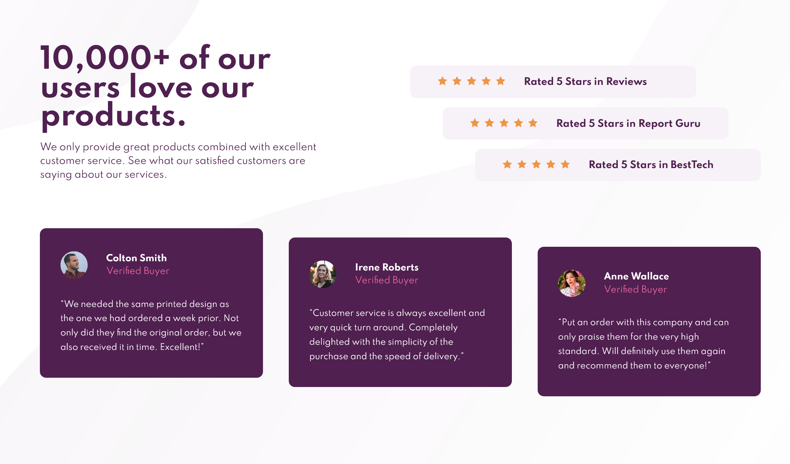

# Frontend Mentor - Social proof section solution

This is a solution to the [Social proof section challenge on Frontend Mentor](https://www.frontendmentor.io/challenges/social-proof-section-6e0qTv_bA). Frontend Mentor challenges help you improve your coding skills by building realistic projects.

## Table of contents

- [Overview](#overview)
  - [The challenge](#the-challenge)
  - [Screenshot](#screenshot)
  - [Links](#links)
- [My process](#my-process)
  - [Built with](#built-with)
  - [What I learned](#what-i-learned)
  - [Continued development](#continued-development)
  - [Useful resources](#useful-resources)
- [Author](#author)

## Overview

### The challenge

Your challenge is to build out this social proof section and get it looking as close to the design as possible.

Your users should be able to:

- View the optimal layout for the section depending on their device's screen size

### Screenshot




### Links

- Solution URL: [https://github.com/franziskawich/social-proof-section](https://github.com/franziskawich/social-proof-section)
- Live Site URL: [https://franziskawich.github.io/social-proof-section/](https://franziskawich.github.io/social-proof-section/)

## My process

### Built with

- Semantic HTML5 markup
- SCSS (saved as CSS)
- Flexbox
- Mobile-first workflow
- BEM

### What I learned

I have read a very interesting article where the author explained that some people can get sick when seeing an animation. After reading this article, I decided to change my code so that the animation is only shown if the user has activated the animation setting on their device.

```css
@media (min-width: 1440px) and (prefers-reduced-motion: no-preference) {
  animation: moveleft2 0.5s ease-in-out 0.25s forwards;
}
```

I learned to use the + selector in combination with identical classes. This is quite useful for margins between elements.

```css
&__item + .rating__item {
  margin-top: 1em;
}
```

I included quote signs for the first time. I did not know that quotes look different in other languages. 😶

```css
&::before {
  content: open-quote;
}

&::after {
  content: close-quote;
}
```

This challenge gave me the opportunity to practice flexbox and media queries a lot.

### Continued development

I am not so happy with the sizing of the user images. Maybe I should use rem units instead of % next time in a similiar situation. I think my HTML could be improved. Next time I will try to use the mobile-first approach but with the desktop design in mind as well. (This time I started writing my HTML mobile-first without looking at the desktop version.)

### Useful resources

- [Tatiana Mac: prefers-reduced-motion: Taking a no-motion-first approach to animations](https://tatianamac.com/posts/prefers-reduced-motion) - This helped me with including an animation only when the user's settings for animations is enabled (and the browser supports it).
- [CSS-Tricks: quotes](https://css-tricks.com/almanac/properties/q/quotes/) - This helped me including the right quotes in this challenge.

## Author

- Frontend Mentor - [@franziskawich](https://www.frontendmentor.io/profile/franziskawich)
- freeCodeCamp - [Franziska Wich](https://www.freecodecamp.org/fcc35fab9df-6b8c-445e-8aec-36ee00e99ba0)
